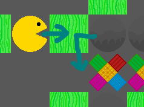

## List of known bugs

### Crucial

###### Uninvestigated

- 

###### Investigated

- 

### Nice to fix

###### Uninvestigated

- 

###### Investigated

- 

## List of fixed bugs

##### [**Boulder-Dash** *generation*] Template level generation works only for square levels

###### Description

When trying to generate level given different width and height (For example width=3, height=9), key not found (in map) is thrown

###### Reason

`i` and `j` in loops were switched for some **Boulder-Dash** specific generation methods (for example: placing rocks)

###### Solution

Simply switching `i` and`j` back to `Vector2(i, j)` was enough

##### [**Boulder-Dash** *gameplay*] Players and movable objects ending up in illegal coordinates

###### Description

It's possible to interfere with falling objects causing both player and the object to end up in illegal position - One of found reasons for that is when a rock would slide, but player eats what's next to it (Situation like in the image)

As you can see, when grass is eaten both player and rock detects that their movement is now possible, so they both begin to move but collide in the center

###### Reason

Up till now, the collision shape was disabled when eating something - so suddenly both player and rock detect any collisions

###### Solution

I introduced 2 different layers - `1` is rocks and other movable objects, `2` is player. On `eat()` only Layer `2` gets disabled - resulting in it still colliding with rocks and all that but not with the player. It resulted in another bug though - with player moving the point while eating it, so movement had to be frozen at `eat()` as well

##### [*Bug category*] *Bug name*

###### Description

###### Reason

###### Solution